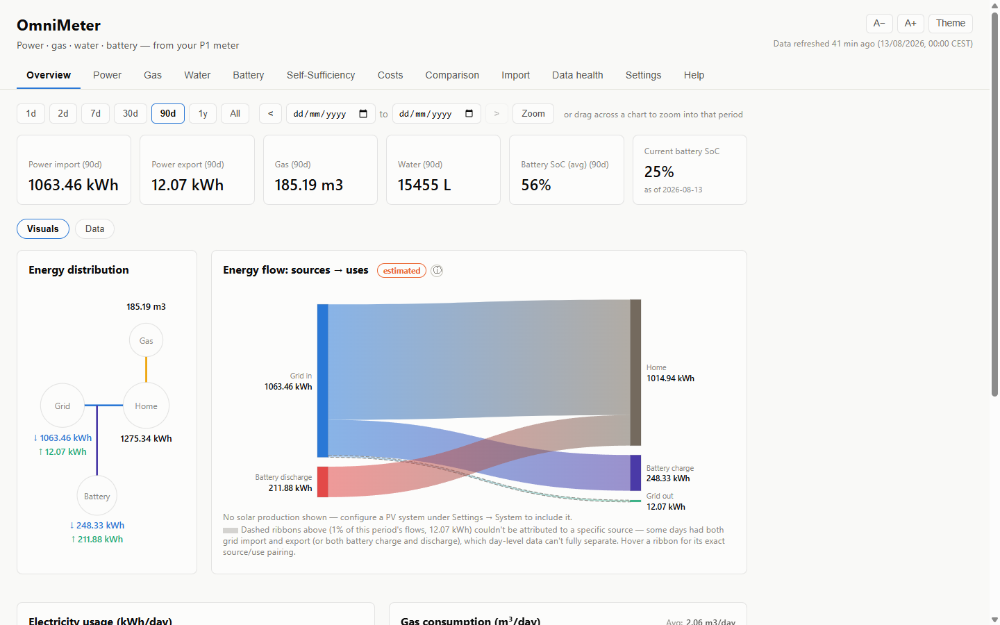
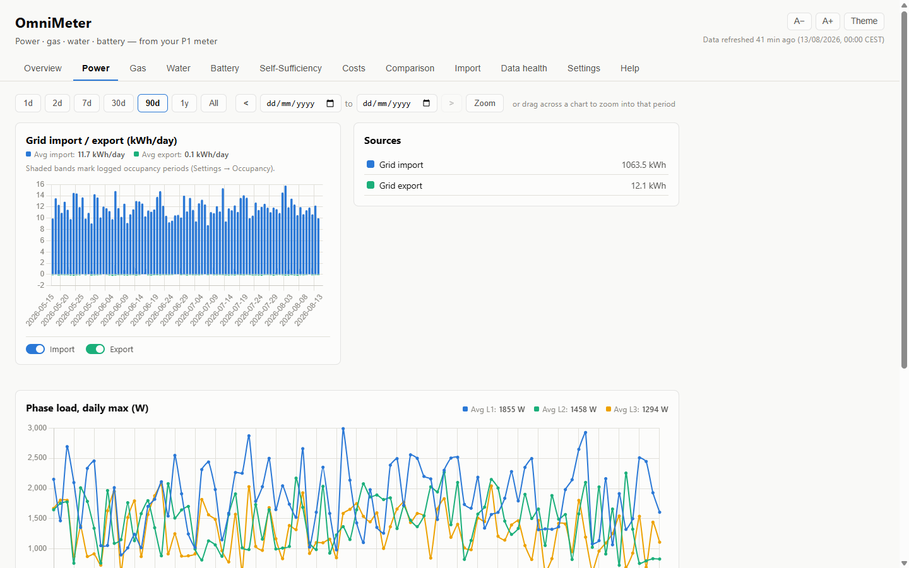
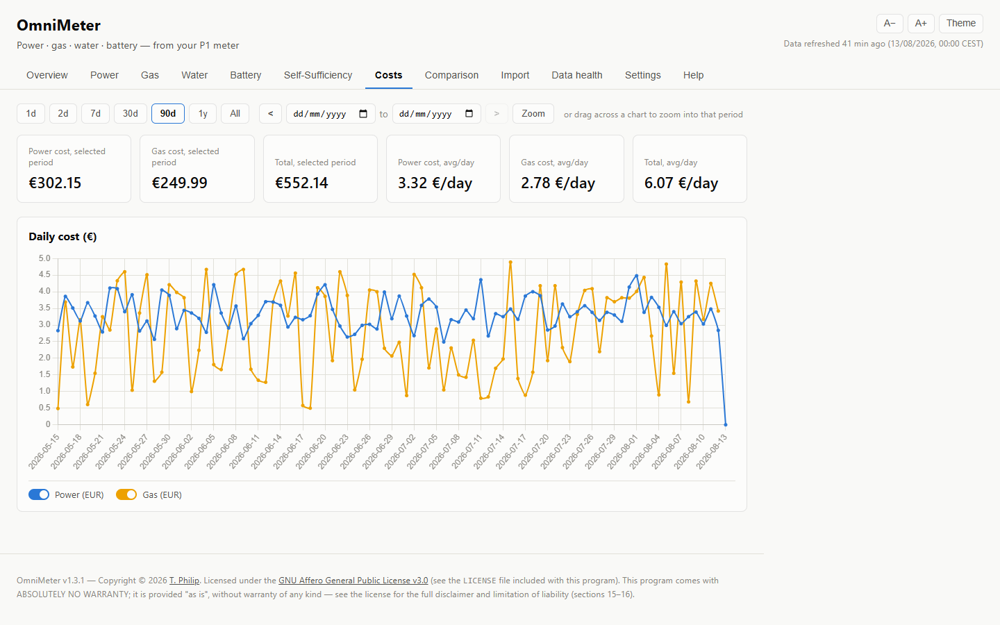
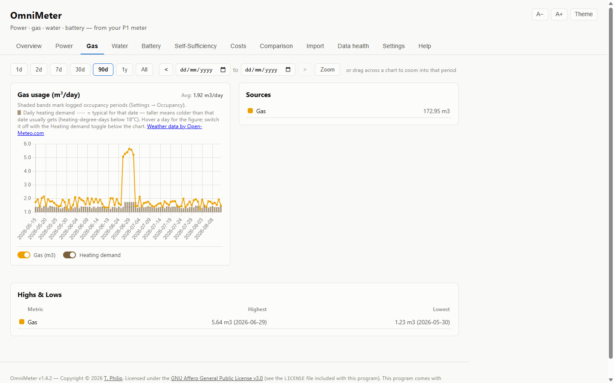

# OmniMeter

Visualizes household power, gas, water, and battery usage from a local P1
smart-meter setup — real time via the local API (P1 meter, Plug-in Battery,
Watermeter), or from CSV exports imported into SQLite.

**Meter hardware: any brand.** Both ways of getting data in work for any P1
meter, live or from files:

- **Live polling** — if your meter serves JSON over your LAN (most do), give
  OmniMeter its URL and tell it what your vendor calls each value. See
  "Live polling from any meter" below.
- **File import** — a vendor-neutral CSV whose columns are OmniMeter's own
  canonical names. See "Importing from any meter" below.

HomeWizard is the only brand that needs **no** configuration for either: its
local API and its CSV export format are recognized out of the box. Every other
brand takes one setup step — stating your meter's own field or column names
once — after which nothing brand-specific is involved. See
`docs/DESIGN_SPEC.md` §3, "Getting data in".

**Energy suppliers: many.** Separate axis, often confused with the above.
Whoever bills you only affects the *rates* used on the Costs tab, and nine
Dutch suppliers' rate sheets are recognized, plus a generic CSV format for
any other — see "Settings" below. Your supplier and your meter brand are
independent choices.

**Where this works: not just the Netherlands.** The P1 port is a shared
European standard (DSMR — Dutch Smart Meter Requirements), not a Dutch-only
quirk. Besides the Netherlands, it's present on smart meters in **Belgium**
(deactivated by default outside Brussels — ask your grid operator, e.g.
Fluvius, to enable it), **Luxembourg** ("Smarty" meters — the port is
encrypted and needs a P1 key from your utility), **Sweden**, **Finland**,
**Denmark**, **Hungary**, **Austria**, and **Norway**. Germany is partial —
only specific meter models (e.g. EasyMeter Q3D) expose a compatible port,
not a national standard. If your meter has a P1 port at all, OmniMeter can
read it regardless of country.

Originally built for, and still running live on, the author's own home lab
— see "Reference deployment" near the bottom if you're running a native
systemd install instead of Docker. Everyone else: start below.

Licensed under [AGPL-3.0](LICENSE). Please credit **t-philip** if you use or share this.
If you modify it and make it available to others over a network, you must offer those
users the source of your modified version.

The interface is English only — see "Language" under "Using the dashboard" below for
why, and for how to read it in your own language anyway without any app changes.

## Highlights

- **Zoom by dragging** — drag straight across any chart to narrow the date
  range to exactly the span you selected, no date-picker fiddling. See "Using
  the dashboard" below.
- **Weather-correlated estimates** — solar self-sufficiency is reconciled
  against real daily weather (Open-Meteo shortwave radiation), not a flat
  seasonal assumption; the Gas tab shows a heating-degree-day rail so cold
  spells and usage spikes are visibly linked.
- **Tariff import, auto-detected** — upload a rate-sheet PDF and OmniMeter
  recognizes the format itself (nine supplier formats today); no supplier
  picker, no manual entry required. See "Settings" below.
- **Bulk historical import** — CSV exports covering years of readings import
  in one file, not just going-forward data.
- **Occupancy correlation** — log who's home and when; consumption charts can
  be read against that overlay.
- **Feature toggles** — hide any tab/category you don't have (gas, water,
  battery, solar), and every outbound network call (weather, update check)
  is its own opt-in switch, off by default.
- **Backup and restore** — automated nightly backups with 30-day retention,
  and a documented restore path. See "Backups" below.

## Screenshots

*(Illustrative data — not a real household.)*

| Overview | Power |
|---|---|
| [](docs/screenshots/overview.png) | [](docs/screenshots/power.png) |

| Costs | Gas — heating-degree-day correlation |
|---|---|
| [](docs/screenshots/costs.png) | [](docs/screenshots/gas.png) |

## Compared to other P1 tools

A few other self-hosted P1/DSMR options exist — worth knowing where OmniMeter
sits among them before you pick one:

- **[DSMR-reader](https://github.com/dsmrreader/dsmr-reader)** is the
  established option (490+ stars, Django-based) and a solid choice if you
  only care about electricity. It's power-only and licensed **free for
  non-commercial use only**. OmniMeter also covers gas, water, and battery in
  one dashboard, with a Costs tab priced against your actual rate schedule,
  and is licensed [AGPL-3.0](LICENSE) — free including commercial use, as
  long as you share source changes with your own users.
- **Small HomeWizard-specific dashboards** (e.g. `p1dash`,
  `homewizard-monitor`) are lighter-weight live-power viewers, generally
  single-device and power-only, without CSV import, cost tracking, or
  multi-category history.
- **HomeWizard's own app** is the easiest path if you only own HomeWizard
  hardware and don't mind a cloud-connected, brand-locked tool. OmniMeter is
  self-hosted — none of your actual data (readings, costs, occupancy, and so
  on) ever leaves your LAN. Two optional features make outbound calls, both
  off by default: weather correlation sends only a coarsened, ~10 km-grid
  location coordinate to Open-Meteo (never an address); the update check
  sends nothing but an anonymous request to GitHub's public releases API. It
  also works with **any** P1 meter brand, not just HomeWizard's.

## Quick Start (self-hosted)

**Already have OmniMeter running and just want a newer version? Skip to "Upgrading"
below instead** — the steps here assume a fresh install, and repeating them over an
existing one (a fresh `git clone`, or re-running the two `cp` lines below) discards
your real database, device pairing, and write-auth token.

Requires only Docker + Docker Compose — no Python install needed on your machine.

```bash
git clone https://github.com/t-philip/omnimeter.git && cd omnimeter \
  && cp .env.example .env && cp devices.json.example devices.json \
  && docker compose run --rm setup && docker compose up -d
```

Or the same steps broken out:

```bash
git clone https://github.com/t-philip/omnimeter.git
cd omnimeter
cp .env.example .env
cp devices.json.example devices.json
docker compose run --rm setup   # interactive — pairs your P1 meter / Plug-in Battery / Watermeter
docker compose up -d
```

Open `http://localhost:8000` (or whatever `OMNIMETER_PORT` you set in `.env`).

**What the setup wizard does:** for each meter you have, asks its IP and walks you through
pairing — press the physical button when prompted, no app account or third-party bot needed.
Generates a random write-auth token automatically. Safe to re-run later: it asks before touching
anything already configured.

**Backups:** a `backup` container runs nightly, writing to `OMNIMETER_BACKUP_HOST_DIR` (set in
`.env`, defaults to `./backups` next to this file) — 30-day retention, pruned automatically. See
"Restoring a backup" below for the self-hosted restore command.

**Uninstalling:** `./uninstall.sh` — stops and removes containers/image first (routine, always
safe, fully recreatable), then asks individually before removing anything that holds real data
(`.env`, `devices.json`, `data/`, your backups directory). Nothing is ever deleted silently.

**Deliberately not built:** HTTPS/reverse-proxy — put this behind your own (Caddy, Nginx, a
Tailscale funnel, etc.) if you need it reachable beyond your own LAN. No multi-user accounts; the
write-auth token above is the only access control, matching the app's existing LAN-only design.

## Upgrading

Update your **existing** install directory in place — don't `git clone` a second copy
and don't repeat the `cp .env.example .env` / `cp devices.json.example devices.json`
lines above. Your real database, `.env`, and `devices.json` only exist in that one
directory, on your own machine, on purpose (see `.gitignore`) — none of it lives in
git, so anything that starts you over in a different or freshly-cloned directory
leaves them all behind with nothing carried forward.

```bash
cd omnimeter        # your existing install directory, not a new clone
git pull
docker compose up -d --build
```

That's it. `git pull` never touches `data/`, `.env`, or `devices.json` — they're
gitignored specifically so a pull can't overwrite them. Any new database columns a
release adds are applied automatically the first time the app starts afterwards (see
the migration functions in `src/db.py`); you don't need to run anything by hand for
that. If a release's notes call out a new `.env` variable, add that one line to your
existing `.env` yourself — don't recopy `.env.example` over it, that would blank out
everything else already in there.

**If you already lost data by re-cloning instead:** check whether the old directory
still exists under its original name, or a renamed/backup copy of it — if so, copy its
`data/omnimeter.db` into the new install's `data/` directory before starting the
containers, then restart. Otherwise, see "Restoring a backup" below for recovering
from the nightly backup, if one exists from before the reinstall.

## Using the dashboard

**Zoom by dragging.** Every chart tab shares one date range, set by the controls
above the charts — presets (7d/30d/90d/1y), or exact From/To dates. The quickest
way is to **drag straight across a chart**: release, and the range narrows to the
span you dragged over. A 90-day view is dense; dragging over a fortnight makes it
readable in one gesture.

That drag sets the *actual* range rather than a chart-only zoom, which keeps
everything in step: the From/To boxes fill in, the preset deselects, every chart
on the tab redraws to match, and the `<` / `>` buttons then step by exactly the
span you selected — so you can walk week by week through a period. Click any
preset to zoom back out. A plain click does nothing, so hover tooltips still work
as normal, and it works on touchscreens too.

**Show and hide series.** The pills under each chart switch individual series on
and off. Everything drawn on a chart gets a pill — including the optional
Sunshine rail — so you can compare just the two things you care about, such as
Import against Export, or Import against sunshine alone. Hiding a series only
hides it; nothing is recalculated.

**Weather (optional, off by default).** Enable it under Settings → Feature toggles
to add daily solar-radiation data from [Open-Meteo](https://open-meteo.com/). It
draws a per-day sunshine rail along the bottom of the solar-driven charts, and
makes the Self-Sufficiency production estimate weather-aware instead of a flat
monthly average. This is the only feature that contacts the internet, and the
request carries your configured coordinates — which are rounded in code before
use (see `OMNIMETER_WEATHER_LOCATION_PRECISION` in `.env.example`; town-level
precision is plenty, because the underlying data is on a ~9 km grid anyway).
Weather data by Open-Meteo.com is licensed CC BY 4.0, and the credit is shown
wherever the data appears.

**Language.** The interface is English only, with no translation system built in —
deliberately: with roughly 800 UI strings across help text, labels, and card copy, and
no non-English users of this dashboard to check translations against, a maintained
translation layer risked shipping wrong terminology nobody could catch. Modern browsers
cover this for free instead. Chrome, Edge, and Brave detect that the page declares
`<html lang="en">`, compare it against your browser's own language, and offer to
translate the page on the spot — entirely in your browser, using your browser vendor's
translation service, with nothing sent to or known by this app (unlike embedding a
translation widget, which would mean every page view leaving your LAN — see "Weather"
above for how carefully this project treats its one existing exception to that). Firefox
has an equivalent free extension. Static text (headings, help popovers, card copy,
buttons, table headers) translates cleanly this way; the Power/Gas/Water/Battery charts
render to `<canvas>`, which is pixels rather than text, so their axis labels and
tooltips are the one thing no translator — browser-native or otherwise — can reach.

**On a phone.** The dashboard is responsive and works in a mobile browser — including
translation (see "Language" above): open the URL directly in your phone's own
Chrome/Edge and the same one-tap translate applies. No packaged Android app ships in
this repo yet.

## Self-hosted configuration

Everything lives in one `.env` file (see `.env.example` for the full list with comments) — device
Bearer tokens and the write-auth token are filled in by the setup wizard, not something you invent
yourself. `devices.json` holds LAN IPs/serials/protocol per device — not secret, safe to inspect —
and is also written by the wizard (see `devices.json.example` for its schema). Env var names are
deliberately generic (`OMNIMETER_P1_TOKEN`, not `HOMEWIZARD_P1_API_TOKEN`) since HomeWizard is one
of several P1-meter brands, even though it's the only vendor actually implemented right now — see
`src/meter_device.py`. The "Configuration" table below documents every variable in full, including
the ones the wizard doesn't touch (timezone, ports).

## Layout

- `src/db.py` — SQLite schema + connection helper
- `src/ingest.py` — CSV parsing, idempotent load into raw `*_readings` tables
- `src/aggregate.py` — daily rollups from cumulative meter readings
- `src/solar_estimate.py` — estimated (not measured) PV production / self-sufficiency
- `src/tariff_parser.py` — `TariffParser` registry + auto-detection for supplier rate-sheet PDFs
  (Vattenfall, Greenchoice), plus the generic CSV import format for any other supplier
- `src/app.py` — Flask app factory + REST API + page routes
- `src/ingest_cli.py` — entry point for `omnimeter-ingest.timer`
- `src/homewizard_api_client.py` — low-level HTTPS client for one HomeWizard local API v2 device
  (loads `devices.json`, cert/hostname verification)
- `src/meter_ingest.py` / `src/meter_poller.py` — field mapping + long-running
  entry point for `omnimeter-api-ingest.service`
- `scripts/pair_homewizard_device.py` — one-time device pairing on the reference deployment, run via
  its own pairing flow, never directly (see "Reference deployment" below)
- `scripts/setup_wizard.py` — the self-hosted equivalent: interactive, run via
  `docker compose run --rm setup`, no bot/secrets-manager involved
- `scripts/backup.py` — entry point for `omnimeter-backup.timer` (reference deployment) / the `backup` container (self-hosted)
- `wsgi.py` — gunicorn entry point for `omnimeter-web.service` (reference deployment) / the `web` container (self-hosted)
- `run-web.sh` — sources `.env`/a secrets-fetch script before starting gunicorn (`OMNIMETER_WRITE_API_TOKEN` must be
  in the environment before Flask starts, see Write authentication below) — **reference deployment only**; the self-hosted
  Docker image reads `.env` directly, see `Dockerfile`/`docker-compose.yml`
- `Dockerfile` / `docker-compose.yml` / `.env.example` / `uninstall.sh` — self-hosted packaging,
  not used by the reference deployment (see "Reference deployment" below)
- `data/` — **not in git**. `data/imports/` is the CSV dropzone; `data/imports/failed/` holds
  uploads that failed to parse (not retried automatically); `data/omnimeter.db` is the SQLite DB.

All services run as a non-root user — the `omnimeter` system user (created by `deploy.sh`) on the
reference deployment, the `omnimeter` container user (created by `Dockerfile`) when self-hosted.

## Configuration

Environment variables that override deployment-specific defaults. Ones with a reference-deployment
default change nothing there if left unset; a few (marked below) only apply to a self-hosted
install and have no reference-deployment equivalent at all.

| Variable | Default | Overrides |
|---|---|---|
| `OMNIMETER_DEVICES_CONFIG` | `/opt/omnimeter/devices.json` | Path to the device registry (see `devices.json.example` for the schema) |
| `OMNIMETER_TIMEZONE` | `UTC` | **Set this to where you actually live.** IANA name, e.g. `Europe/Amsterdam`, `America/New_York`, `Asia/Kolkata`. Resolved once in `src/localtime.py`, the single place every other module gets it from — it decides where a day starts and ends, so it drives reading timestamps, daily-total/chart day boundaries, the Open-Meteo weather day, and the start date of any tariff whose document states no date of its own. Left unset it falls back to UTC with a warning in the logs, not silently — near midnight that's the wrong day, not a rounding error. An invalid name stops the app on startup rather than timestamping data in the wrong zone. The self-hosted setup wizard asks for this explicitly (also defaulting to UTC, so accepting the prompt without typing anything is still worth double-checking). |
| `OMNIMETER_WRITE_API_TOKEN` | *(none — required)* | Write-auth token, see "Write authentication" below. Auto-generated by the self-hosted setup wizard; the reference deployment sources it from its own secrets manager. |
| `OMNIMETER_P1_TOKEN` / `OMNIMETER_BATTERY_TOKEN` / `OMNIMETER_WATERMETER_TOKEN` | *(none)* | Per-device Bearer token env var names, as declared in each device's `devices.json` entry's `token_env` field — these three are `devices.json.example`'s defaults for a fresh self-hosted install. The reference deployment's own `devices.json` declares `HOMEWIZARD_*_API_TOKEN` instead (accurate there — that hardware genuinely is HomeWizard); either way the name is config, not hardcoded in Python. Filled in by pairing (the setup wizard, self-hosted; `scripts/pair_homewizard_device.py` on the reference deployment, see "Reference deployment" below). |
| `OMNIMETER_BIND` | *(set per install)* | gunicorn bind address, e.g. `0.0.0.0:8000` to listen on every interface or `<lan-ip>:8000` to pin it to one. Only used by a native systemd install's own start script; the Docker image always binds `0.0.0.0:8000` inside the container and publishes it via `OMNIMETER_PORT` instead (below). |
| `OMNIMETER_PORT` | `8000` | Self-hosted only — host port `docker compose` publishes the dashboard on. |
| `OMNIMETER_BACKUP_DIR` | `./backups` | Nightly backup destination (`scripts/backup.py`, `scripts/restore.py`). The default is a bare-run fallback only — both real deployment shapes set this explicitly instead: in `docker-compose.yml` it's fixed to `/backups` (a container-internal mount point, not user-edited directly), and a native systemd reference deployment sets it in its own backup service unit. |
| `OMNIMETER_BACKUP_HOST_DIR` | `./backups` | Self-hosted only — where that `/backups` mount actually points to on your machine. This is the variable you actually set in `.env`. |

`devices.json` holds LAN IPs/serials, not secrets — the reference deployment's
repo commits its real one; a self-hosted install starts from `devices.json.example` instead
(the setup wizard fills it in for you — see Quick Start above).

## Adding new export data

**Self-hosted:** copy CSV exports into the bind-mounted dropzone directly:

```
cp <file>.csv ./data/imports/
```

The `ingest` container picks them up within 15 minutes, or force it immediately:

```
docker compose restart ingest
```

**Reference deployment (native systemd):** copy directly to the dropzone:

```
cp <file>.csv /opt/omnimeter/data/imports/
```

`omnimeter-ingest.timer` picks them up within 15 minutes, or force it immediately:

```
systemctl start omnimeter-ingest.service
```

Re-exporting a wider date range is safe — files are re-ingested by content
hash, and rows are keyed by timestamp (`INSERT OR REPLACE`), so nothing
duplicates.

## Importing from any meter (vendor-neutral CSV)

If your meter isn't a HomeWizard, this is the way in. Download a template:

```
curl -O -J "http://localhost:8000/api/import/meter-csv/template?category=power"
```

(`category` is one of `power`, `gas`, `water`, `battery`.) Fill it in and drop
it in the dropzone, or upload it under Import → CSV. The rules:

- **Name the file `omnimeter-<category>-<anything>.csv`.** That prefix is what
  selects this format — without it the file is judged against the HomeWizard
  export format and rejected.
- **The header row uses OmniMeter's own column names** (the template lists the
  valid ones for each category). Include only the columns your meter reports
  and leave the rest out entirely. A column name that isn't recognized is
  **rejected**, not ignored — so a typo is reported rather than silently
  discarding that column's data.
- **Values are cumulative meter readings, not per-period usage.** OmniMeter
  derives usage by differencing consecutive readings.
- **`time` is `YYYY-MM-DD HH:MM`.** Rows a day apart are stored as daily
  readings; closer together as 15-minute data. Daily-only meters are fine —
  everything except the few genuinely sub-daily features works normally.

No dual-tariff meter? Use `import_combined_kwh` / `export_combined_kwh` on
their own and omit the T1/T2 columns entirely.

### Live polling from any meter (JSON over HTTP)

If your meter serves its readings as JSON on your LAN — most do — you can poll
it directly instead of importing files, without any code being written for your
brand. Add an entry to `devices.json` with `"protocol": "generic_json"` and tell
OmniMeter what your vendor calls each value:

```json
{
  "p1": {
    "protocol": "generic_json",
    "url": "http://192.0.2.10/api/v1/data",
    "token_env": null,
    "field_map": {
      "import_t1_kwh":       "total_power_import_t1_kwh",
      "import_t2_kwh":       "total_power_import_t2_kwh",
      "import_combined_kwh": "total_power_import_kwh",
      "export_combined_kwh": "total_power_export_kwh",
      "l1_max_w":            "active_power_l1_w"
    }
  }
}
```

- **Left side** = OmniMeter's canonical names (the same ones the CSV template
  lists). **Right side** = whatever your meter's JSON calls them. Use dots for
  nested values (`"data.power.import_kwh"`).
- **Only map what you have.** Anything you leave out is simply not recorded.
- **`token_env`**: the name of an environment variable holding a bearer token,
  if your meter needs one. Use `null` if it doesn't — most LAN meter APIs are
  unauthenticated.
- **If nothing maps**, the poller reports a `field_mapping_error` naming the
  keys your meter *did* return, so you can correct the map — it will not write
  a row of empty values.

There is deliberately no auto-detection of vendor. Two brands can use the same
key name for different quantities (cumulative vs. instantaneous, Wh vs. kWh),
and guessing wrong would write plausible but wrong numbers instead of failing —
the worst outcome for a meter-reading app. An explicit map can't be wrong
silently.

## Write authentication

A security review found every state-changing request (`/api/import/*`, `/api/settings/*`, and any
future POST/PUT/PATCH/DELETE route by default — the check is on HTTP method, not a route allowlist)
must carry an `X-OmniMeter-Write-Api-Token` header matching `OMNIMETER_WRITE_API_TOKEN`. Without it: `401`.
GET requests are unaffected.

The dashboard's own UI sends this automatically — `index.html` embeds the token as
`window.OMNIMETER_WRITE_API_TOKEN` on page load, and `dashboard.js`'s `writeHeaders()` attaches it to
every write request. This isn't meant to stop a determined attacker already on the LAN (the token
is visible in the page source to anyone who loads the dashboard, same as any first-party page's
own client-side state) — it stops accidental or automated writes from other LAN devices that never
render the page as a browser. The app's LAN-only design remains the primary control; this raises
the bar above "any device can POST here with no interaction at all."

`create_app()` fails closed: if `OMNIMETER_WRITE_API_TOKEN` isn't in the environment at startup, it
raises rather than starting with unauthenticated writes. `run-web.sh` fetches it from a secrets
manager before `gunicorn` starts on the reference deployment; a
self-hosted install gets it auto-generated into `.env` by the setup wizard instead (see Quick
Start above) — `docker-compose.yml` passes `.env` straight into each container's environment, no
external secrets manager involved anywhere in that path.

## HomeWizard local API v2

`omnimeter-api-ingest.service` polls the P1 meter, Plug-in Battery, and Watermeter directly
over their own local API v2 endpoints (not a timer like `omnimeter-ingest`
— a long-running loop, ~20s interval, to actually deliver on "real-time"). Each device is a
separate integration: its own IP, own pairing, own Bearer token.

**Why it still writes `granularity='api_live'`, not `'live'`:** originally this was a deliberate
supplement, not a replacement, for HA's `'live'` data, validated in production before being
trusted. That validation is done: a later change (2026-07-28) removed the HA sync
path entirely, so `'live'` rows are no longer written by anything going forward. `api_live` was
left unranked rather than promoted, because it doesn't need to be — `aggregate.py`'s
`_GRANULARITY_RANK` (`{"live": 3, "15min": 2, "daily": 1}`) ranks per date, and an unranked
granularity (rank 0) already wins whenever no higher-ranked row exists for that date. `'live'`
itself stays in the dict permanently: years of real historical HA data already sit in the DB at
that granularity and must keep outranking any CSV re-import for the same dates.

**Setup:** devices are set up **one at a time**, not all-or-nothing —
`homewizard_api_client.is_configured()` gates each device independently, so the service starts
and polls whatever's ready, skipping any device still on its `"REPLACE_ME"` placeholder (see
`meter_ingest.ingest_all()`'s `'skipped: device not configured'` status), same as it
already tolerates a device with no token yet. **Self-hosted:** `docker compose run --rm setup`
(see Quick Start above) does the pairing interactively, no bot/account needed. **Reference
deployment:** see "Reference deployment" below for the flow this repo's own live install uses.

**Not every device has v2 yet:** confirmed live 2026-07-24 that the P1 meter and Plug-in Battery
both have API v2 enabled, but this Watermeter unit (HWE-WTR-13, firmware 3.01) only exposes the
older v1 local API in the app — a generic "Local API" toggle, not "API v2 (experimental)". v1 is
plain HTTP with no auth and needs no pairing at all; `DEVICES["watermeter"]["protocol"] = "v1"`
routes it through `fetch_measurement_v1()` instead of the pairing/Bearer-token flow the other two
use. If a firmware update later adds v2 support, flip that field back to `"v2"` and pair it through
the normal flow (its ip/serial are already on file).

**Correction (2026-07-28):** an earlier version of this README claimed the Plug-in Battery's
`/api/measurement` only exposes `state_of_charge_pct`/`power_w`, with no cumulative import/export
kWh field. That was never verified against a live response and was wrong — the device does return
`energy_import_kwh`/`energy_export_kwh`, and `meter_ingest._map_battery()` now maps them
into `battery_readings.import_kwh`/`export_kwh` for `api_live` rows, same as HA's equivalent
sensors. Gas is similarly available in real time: it isn't a separate HomeWizard device, but DSMR
smart meters relay the gas meter reading through the P1 telegram, which the P1 dongle's own
`/api/measurement` surfaces via an `external: [{"type": "gas_meter", ...}]` entry —
`meter_ingest._map_gas()` extracts it and writes `gas_readings` rows alongside each
successful P1 poll.

**Real gotchas found only by testing against actual hardware** (none of this is documented by
HomeWizard, or the docs are actively misleading) — check any new device's live certificate before
trusting a "standard" scheme:

- A `curl --resolve`-based pairing script failed outright: HomeWizard's local-API identity string
  is shaped `appliance/{product_type}/{serial}`, which contains slashes and cannot be represented
  as a URL host or `--resolve` token at all (URLs use `/` as the path separator) — it silently
  tried to resolve the literal string `"appliance"` and failed. Fixed by using Python's
  `urllib3.HTTPSConnectionPool` with `assert_hostname=`, a pure string comparison against the
  cert, entirely decoupled from URL/DNS parsing (see `homewizard_api_client.py`).
- The P1 meter's certificate carries that identity in the Subject **Common Name only, with no
  SAN** — modern TLS verification checks the SAN exclusively, so CN-fallback needs a caller-built
  `ssl.SSLContext` with `hostname_checks_common_name=True` explicitly. The simpler
  `ca_certs=`/`cert_reqs=` kwargs make `urllib3` build its own context that hardcodes this to
  `False` regardless.
- The Plug-in Battery's certificate is **not the same scheme as the P1 meter's** — same CN
  pattern, but it also carries a DNS SAN (`{serial}.battery.device.homewizard.energy`), and once a
  certificate carries any SAN it is matched against the SAN *exclusively* — CN-fallback doesn't
  apply once a SAN exists. There is no formula deriving the right identity from
  `product_type`+`serial` across HomeWizard's device types; each device's real certificate must be
  inspected (`openssl s_client -connect {ip}:443 | openssl x509 -noout -text`) and the correct
  value stored explicitly per device (`devices.json`'s `verify_hostname` field). The self-hosted
  setup wizard automates this inspection step for you (trust-on-first-use, same model as an SSH
  host-key prompt) — see Quick Start above.

## Settings

PV kWp rating and the Costs rate schedule are entered via the **Settings** tab in the UI
(or `POST /api/settings/pv` / `/api/settings/rates` / `/api/settings/gas-rates`).
The Self-Sufficiency and Costs pages stay in an explicit "not available yet"
state until these are populated — no page silently shows a wrong number.

**Bulk rate import, under Import → Tariffs, instead of typing periods in one at a time.**
Upload a PDF and OmniMeter auto-detects the format — no supplier picker, and the result
names which one it recognized so you can see it isn't guessing. Nine formats are supported
today. Seven are downloadable documents, straight from each supplier's own website: both of
Vattenfall's (the personal, retrospective **Tarievenspecificatie** your own account portal
gives you, closed date ranges, and the public, open-ended **Tarievenblad**), and one public,
open-ended Modelcontract tariff sheet each from **Greenchoice**, **Pure Energie**, **Innova
Energie**, **Mega Energie**, and **Clean Energy**. Two — **Eneco** and **Budget Thuis** — are
live webpages rather than a document at all, so the input there is a PDF *you* create: open
the page and use your browser's Print → Save as PDF, then upload that. Eneco's page needs no
extra steps; Budget Thuis's does — accept its cookie banner and click open "Tarievenblad
Modelcontract voor onbepaalde tijd met variabele tarieven" *before* printing, or the saved PDF
captures the cookie overlay instead of the rate table. Neither states an effective date on the
page itself, so their imported rate period starts on the day you upload it rather than a date
the supplier claims — a stale, previously-saved copy uploaded later will misdate itself, so
save a fresh one; every other supplier's document states its own date instead. **Any other
supplier**: download the CSV template from the same tab (`GET /api/import/tariff-csv/template`)
and fill in your rate periods by hand from your bill — format is
`category,period_start,period_end,rate` (see `parse_tariff_csv()` in `src/tariff_parser.py`
for the full rules), or use the manual one-period-at-a-time form in Settings → Rates instead.
A document nothing recognizes is rejected outright with the list of supported formats, rather
than risking a partial or wrong parse.

**Fiscal year start:** `fiscal_year_config` (`GET`/`POST /api/settings/fiscal-years`)
controls what date range each tab's "1y" preset button resolves to — the configured
month/day through today, not a fixed 365-day trailing window. Defaults: Power and Gas
start 1 May (the Dutch utility billing year), Water starts 1 Jan (calendar year). Costs,
Overview, Battery, and Self-Sufficiency all use the Power boundary (see
`FISCAL_CATEGORY_BY_TAB` in `dashboard.js`), since they aren't billed on a cycle of
their own.

**Feature toggles:** `feature_toggles` (`GET`/`POST /api/settings/toggles`) is a
full-replace singleton row (like PV/fiscal-years above, not an append-a-row form) —
a `POST` sets every field, so a partial payload disables anything it omits. The Settings UI
form always submits all six, matching native HTML checkbox semantics (a checked box is
included, unchecked is simply absent — both map correctly onto "full replace, missing means
off"). Toggles: `import_power_enabled` / `import_gas_enabled` / `import_water_enabled`
(gate CSV ingest per category — checked once, in `ingest.ingest_file()`, so both the web
upload route and the dropzone timer respect it), `pdf_import_enabled` (gates
`/api/import/tariff-pdf`), `nightly_backup_enabled` (gates `omnimeter-backup.timer`, see
Backups below), and `homewizard_api_enabled` — gates `omnimeter-api-ingest.service`
(see above), checked once per poll loop iteration so toggling it off takes effect within one
cycle, not just on next restart. Every gate skips/rejects
cleanly rather than erroring: a disabled scheduled job exits 0 (so `job_monitor.py` doesn't
flag a deliberate pause as FAILED), a disabled web upload route returns `403` with a clear
message.

## Backups

`omnimeter-backup.timer` runs nightly (03:30 UTC), backing up `omnimeter.db` via SQLite's
online backup API to the configured backup destination (30-day retention) — the CSV exports
are re-exportable from the HomeWizard app, but historical HA-sourced data (from before a later
change removed that path), the real-time `api_live` history, the rate schedules, and `pv_config`
are not recoverable from anywhere else. On the reference deployment this requires its own bind
mount to be present; `deploy.sh` only enables the timer once it is. Can be paused
from the Settings tab (`nightly_backup_enabled`) — e.g. during a schema migration, or while the
backup mount is intentionally down for maintenance, so the timer doesn't fail loudly every
night in the meantime.

### Restoring a backup

`scripts/restore.py` is the tested counterpart to `backup.py` — until it existed,
restore had never been exercised even in principle. It only handles the DB-file-level restore;
it does **not** stop or start anything itself — stop the write paths yourself first.

**Self-hosted:**

```
docker compose stop web ingest api-ingest
docker compose run --rm web python -m scripts.restore --list
docker compose run --rm web python -m scripts.restore --latest
docker compose start web ingest api-ingest
```

**Reference deployment (native systemd):**

```
systemctl stop omnimeter-web.service omnimeter-ingest.timer omnimeter-api-ingest.service
cd /opt/omnimeter && .venv/bin/python -m scripts.restore --list
cd /opt/omnimeter && .venv/bin/python -m scripts.restore --latest
systemctl start omnimeter-web.service omnimeter-ingest.timer omnimeter-api-ingest.service
```

`--latest` restores the newest backup; `--file <name>` restores a specific one from the `--list`
output; `--yes` skips the interactive confirmation prompt (useful for scripting, not recommended
for a manual recovery).

## Tests

Test-only dependencies (pytest and friends) live in `requirements-dev.txt`, separate from the
production `requirements.txt` gunicorn actually needs:

```
cd /opt/omnimeter
.venv/bin/pip install -r requirements-dev.txt   # once
.venv/bin/python -m pytest tests/ -v
```

## Lint / type-check

Config in `pyproject.toml` (baseline mypy, not strict mode — this codebase was never type-checked
before a code review added the config):

```
.venv/bin/python -m ruff check .
.venv/bin/python -m mypy src/ scripts/ wsgi.py
```

## Releasing

The running version is shown in the page footer and at `GET /api/version`, sourced from the single
constant in `src/__version__.py`. To cut a release: bump that constant, commit it alongside the
change it describes, **then** tag and publish — never bump after tagging, or the two drift:

```
git tag vX.Y.Z
gh release create vX.Y.Z --title "vX.Y.Z" --notes "..."
```

## Reference deployment (native systemd)

**Docker Compose (Quick Start, above) is the supported way to run OmniMeter.**
This section is not a second supported install path — it describes how the author's own
instance happens to run, for readers who prefer systemd to Docker and are willing to
assemble it themselves. The unit files it relies on are not in this repository, nothing
here is packaged or tested for it, and questions about it aren't really answerable
generically. Use the Quick Start unless you actively want to do this work yourself.

That install runs natively via systemd, no Docker involved — a plain venv,
`run-web.sh`/`run-api-ingest.sh` as the systemd unit entry points, and the services listed under
Layout above, each with its own unit file. `requirements.txt` changes are **not** auto-installed
on this path — run `.venv/bin/pip install -r requirements.txt` manually after a dependency change.

Device pairing here uses a separate one-time script that talks directly to each device's local
API over the LAN (same `assert_hostname`-based TLS approach described in "HomeWizard local API
v2" above), run manually per device rather than through the Docker Compose setup wizard. The
resulting Bearer token is written to whatever secrets store that deployment uses; `devices.json`
is still the single source of truth for IPs/serials/protocol either way.
